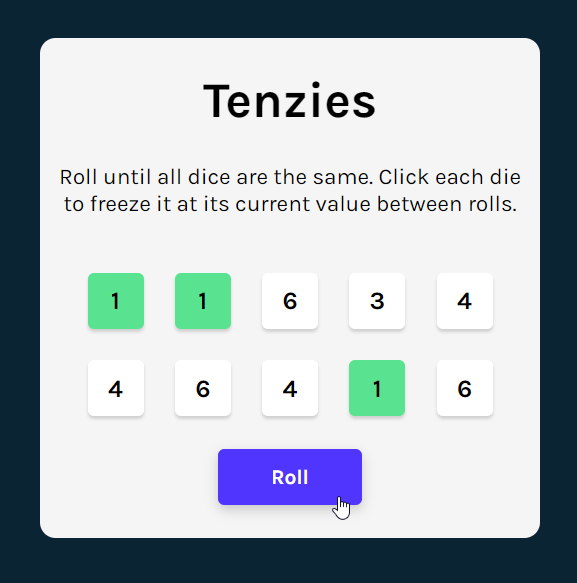

# Tenzies Game

Roll until all dice are the same. Click each die to freeze it at its current value between rolls.

This game is developed thourgh [Scrimba React course](https://scrimba.com/learn-react-c0e).

## Play Tenzies
1. Clone the repo.
2. Install NPM packages using
   `npm install`.
3. Run `npm run dev` command.

## Screenshot
